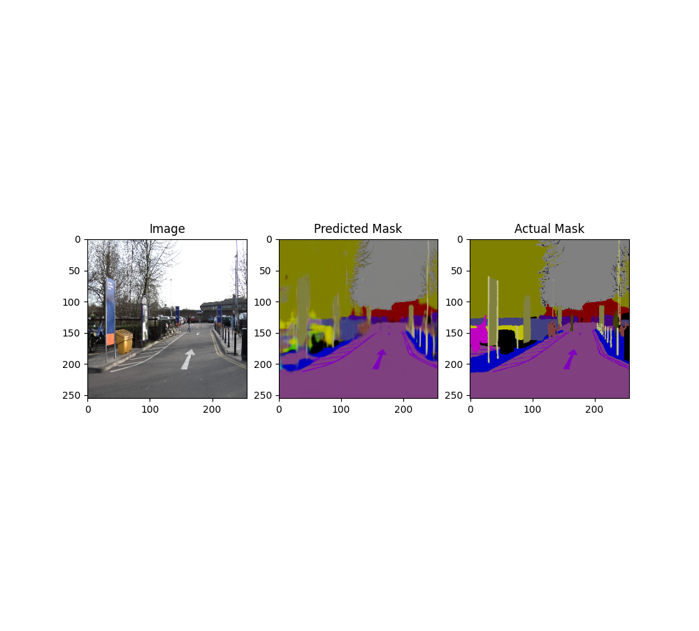
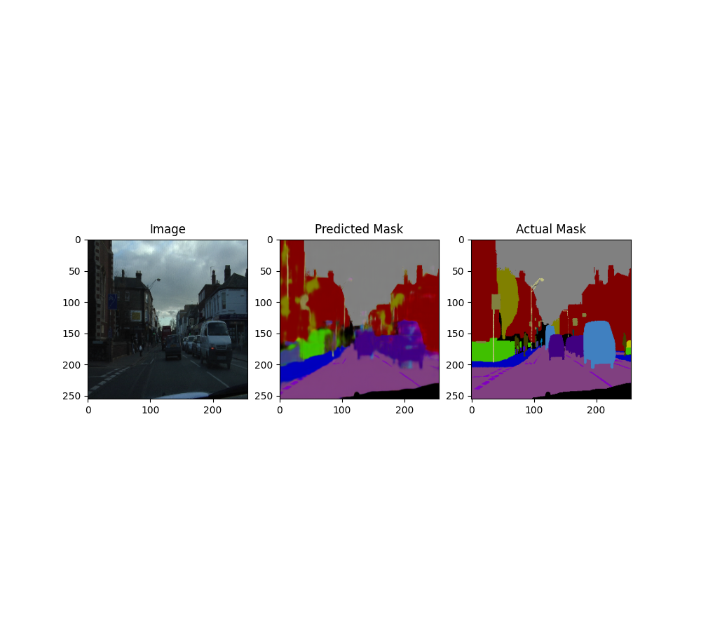

# Segmentation for Self-Driving Car by U-Net
This is a personal project for educational purposes. Based on the training loss plot and some predicted images, it's evident that the model performs well with bright images. However, it struggles with darker images and doesn't predict accurately during image segmentation.

# Result - Training loss 
 

## Sources

 - [Data Set](https://www.kaggle.com/datasets/carlolepelaars/camvid)
 - Coursera 
 
